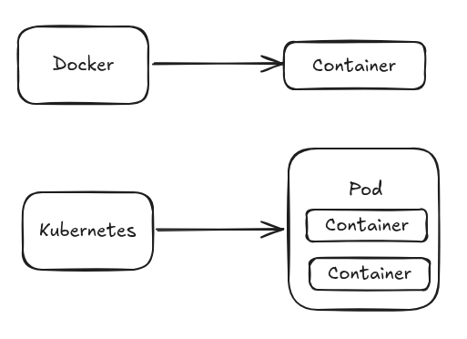
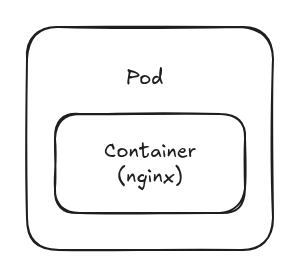
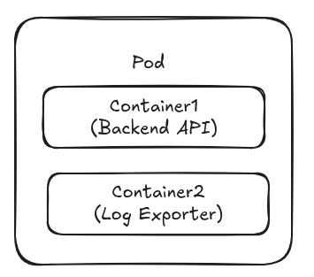

# Basic Command kubernetes

```bash
# untuk melihat node kubernetes
kubectl get nodes

# untuk melihat semua resource yang berjalan di dalam kubernetes
kubectl get all --all-namespaces

# untuk melihat namespace di kubernetes
kubectl get ns
 
```
# Basic command membuat, modifikasi, atau menghapus service

```bash
# Apply configurasi
kubectl apply -f nama-file.yml

# Menghapus rescource
kubectl delete -f nama-file.yml atau
kubectl delete (resource) (nama)

```
# Contoh gambaran sederhana running service 
buat file dengan nama pod.yml kemudian isi filenya dengan konfigurasi berikut :
```bash
apiVersion: v1
kind: Pod
metadata :
  name: nginx-demo #nama pod
spec:
  containers:
    - name: nginx
      image: nginx:1.25
      ports:
        - containerPort: 80
```
konfigurasi tersebut untuk menjalankan nginx
kemudian deploy dengan command berikut :
```bash
# deploy 
kubectl apply -f pod.yml

# cek status pod apakah running atau tidak
kubectl get pod
NAME         READY   STATUS    RESTARTS   AGE
nginx-demo   1/1     Running   0          6m54s

# cek logs pada pod yang sudah kita deploy
kubectl logs -f nginx-demo

# masuk kedalam pod service
kubectl exec -it nginx-demo -- bash

# untuk menghapus pod yang sudah kita buat 
kubectl delete -f pod.yml atau
kubectl delete pod nginx-demo

#maka akan muncl seperti berikut 
pod "nginx-demo" deleted

```
# Basic command mengelola context dan namespace 
```bash
# melihat context
kubectl config get-contexts

# mengubah context
kubectl config use-context (nama)

# menggunakan namespace tertentu
kubectl get pod -n kube-system

```

# Pod
Pod adalah unit terkecil yang bisa dijalakan di kubernetes. aplikasi yang kita jalankan akan berada di dalam sebuah pod.
berikut ilustrasi perbandingan antara pod dengan container pada docker :



Pod tidak sama dengan container, karena di dalam satu pod memungkinkan ada lebih dari satu container.

Mindset 
Kubernetes tidak menjalankan container secara langsung.
kubernetes bekerja di level yang lebih tinggi dibanding docker.

Docker adalah container runtime
Fungsinya untuk, membuat menjalankan dan menghentikan container

Kubernetes adalah orchestrator
fungsinya mengatul banyak hal
- menjadwalkan workload ke banyak mesin
- menjaga jumlah replika
- mengatur networking
- menjaga sistem sesuai desired stated




Pod adalah abstraksi yang lebih luas dari container. dimana container di bungkus dalam sebuah pod

Analogi Sederhana (logistik)
- Container = Barang
- Pod = Paket
- Kubernetes = Sistem Logistik

Di dalam sebuah Pod memungkinkan kita untuk menjalankan lebih dari satu container.



Satu pod banyak container
Terdapat kondisi dimana aplikasi tidak berjalan sendirian :
- satu container menjalankan Aplikasi backend
- satu container menjalankan Log Expoter
- Keduanya berkomunikasi via Localhost

Istilah Sidecar sering digunakan untuk menggambarkan ada 2 container yang berjalan di satu pod.
Container utama fokus menjalankan aplikasi bisnis (API). container lainnya bertugas sebagai komponen pendukung.
